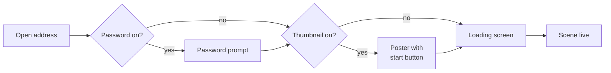
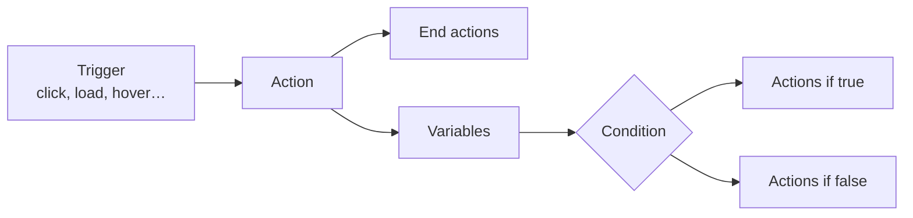

# Badvisor Viewer — Feature Guide

As of 18 September 2026

## About this guide

This guide lists every feature of the current Badvisor viewer, so each one can be recognised and tried in the live platform. It is written for a developer who knows Three.js and is new to this product.

The viewer is one application with two jobs. It is the **public player** that visitors see when a scene is embedded on a customer's website, and it is also the **editor** that creators use from the admin panel. The same code runs both; edit mode is switched on by a URL parameter.

|                     |                                                                     |
| ------------------- | ------------------------------------------------------------------- |
| Repository          | `badvisor-viewer-v4`                                                |
| Stack               | React 18, Vite, **Babylon.js 7** (not Three.js)                     |
| Data                | Firebase Firestore and Storage, read directly from the browser      |
| Public address      | `https://app.badvisor.io/{organisation}/{project}/{scene}`          |
| Opened by the admin | the same address with `?editmode=true`, inside a full-screen iframe |

Each section names the files where a feature lives, so the behaviour can be traced into the code. Babylon names such as `ArcRotateCamera` and `PBRMaterial` are kept as they appear in the product, because they are also the names stored in saved scenes.

The last two sections show which features customers actually use, measured across all 28,201 stored scenes, and give a step-by-step walkthrough to try with the test account.

## Opening a scene

A scene is opened by its address, and URL parameters switch on the editor, immersive modes and debugging behaviour. Routes are declared in `src/Router.jsx`; the scene is fetched in `src/App.jsx` and `src/helpers.js`.

### Addresses

| Address                                | What opens                                                          |
| -------------------------------------- | ------------------------------------------------------------------- |
| `/{organisation}/{project}/{scene}`    | The scene, for the public or, with `?editmode=true`, in the editor  |
| `/{organisation}/{project}/{scene}/ar` | The same scene through the AR route                                 |
| `/{organisation}/pages/{page}`         | A page from the page builder (see Other surfaces)                   |
| `/sandbox`                             | An empty scene in the editor, with nothing loaded from the database |
| `/viewer`                              | An empty scene in the player, with nothing loaded from the database |

All three segments of a scene address are handles, not ids. The viewer resolves the organisation, then the project, then the scene. An unpublished scene only opens when the visitor arrives from the admin panel.

### URL parameters

| Parameter               | Effect                                                                               |
| ----------------------- | ------------------------------------------------------------------------------------ |
| `editmode=true`         | Loads the editor over the scene. Used by the admin's Visual Editor button            |
| `version=<id>`          | Loads a saved version of the scene instead of the current one                        |
| `vr=true`               | Shows the VR entry button                                                            |
| `ar=true`               | Shows the AR entry button                                                            |
| `vto=head`              | Starts virtual try-on with the front camera and face tracking                        |
| `naked=true`            | Hides overlays and material controls, and makes nothing clickable: the bare 3D scene |
| `data=<json>`           | Merges JSON into the scene for this view only — how saved configurations are shared  |
| `nodes=<json>`          | Merges property overrides into the scene's objects for this view only                |
| `config=<value>`        | Read while parsing the scene; reserved for configuration links                       |
| `forceWebGPU=true`      | Uses the WebGPU renderer even where it would normally be skipped                     |
| `disableWebGPU=true`    | Always uses WebGL                                                                    |
| `parentOrigin=<origin>` | The origin of the embedding page, for the postMessage API                            |
| `uid=<id>`              | Passed by the admin when it opens the editor                                         |
| `cache=true`            | Registers the service worker, so assets are cached for repeat and offline visits     |

Parameters combine. For example, `?ar=true&naked=true` shows only the scene and the AR button.

## Before the 3D appears

A visitor can pass through up to four screens before the scene renders, in this order. Each one is configured per scene in the admin panel, not in the editor.



| Screen           | What the visitor sees                                                                                                                                                        | Settings behind it                                                                                            | Code                                |
| ---------------- | ---------------------------------------------------------------------------------------------------------------------------------------------------------------------------- | ------------------------------------------------------------------------------------------------------------- | ----------------------------------- |
| Password prompt  | A lock icon, a password field and an **Unlock** button; a wrong entry shows “Wrong Password”                                                                                 | `enableScenePassword`, `scenePassword`                                                                        | `src/App.jsx`                       |
| Thumbnail poster | A full-screen image or colour with a play button; nothing 3D loads until it is pressed                                                                                       | `enableThumbnail`, `thumbnailBackground`, `thumbnailBackgroundColor`, `thumbnailButton` (custom button image) | `sceneComponents/Thumbnail.jsx`     |
| Loading screen   | A background image or colour, a logo (Badvisor's by default), a thin progress bar across the top, and “Loading asset 3 of 7”, then “Setting up scene…” and “Starting Scene…” | `enableLoadingScreen`, `loadingScreenBackground`, `loadingScreenBackgroundColor`, `loadingScreenLogo`         | `sceneComponents/LoadingScreen.jsx` |
| Scene            | The canvas, any overlays, and the watermark if one applies                                                                                                                   | —                                                                                                             | `sceneComponents/Scene.jsx`         |

The thumbnail poster saves bandwidth on pages where many scenes are embedded: the models download only after the visitor chooses to start.

**Watermark.** A Badvisor logo badge linking to badvisor.io appears in the corner when the organisation has no subscription, or when its visits exceed the plan's limit. Scenes opened from the admin never show it.

**Custom fonts** set on the scene are loaded in the background while the scene starts, so they never delay the first frame.

**Other states.** An address that matches nothing shows a Not found page. On iOS and iPadOS 26.5 or later, public visitors see a compatibility screen instead of the scene while a set of WebKit rendering issues is resolved; the editor and the sandbox are exempt. Right-click is disabled on public scenes.

## Moving around

A scene has one or more cameras, one of which is the default, and each is one of two kinds: an orbit camera for looking at a product, or a first-person camera for walking through a space. Their properties are defined in `src/nodesProps.js` (`arcRotateCameraProps`, `universalCameraProps`) and built in `sceneFunctions/createSceneElements.js`.

### Orbit camera (`ArcRotateCamera`)

The visitor drags to orbit, scrolls or pinches to zoom and right-drags to pan around a target point. Used by almost every scene.

| Setting                                                   | What it does                                                                                                                |
| --------------------------------------------------------- | --------------------------------------------------------------------------------------------------------------------------- |
| Distance, horizontal and vertical angle                   | The starting position around the target, in degrees                                                                         |
| Target, target offset                                     | The point orbited, and an on-screen offset to frame the product off-centre                                                  |
| Min and max distance                                      | How far the visitor can zoom in and out                                                                                     |
| Min and max horizontal and vertical angle                 | Limits the orbit, e.g. to stop the camera going under the floor; “clear” buttons remove them                                |
| Allow upside down                                         | Lets the camera pass over the top                                                                                           |
| Autorotation                                              | Spins the product when idle, with speed, wait time and spin-up time                                                         |
| Mouse hover parallax                                      | The view shifts slightly as the pointer moves, without clicking                                                             |
| Mouse hover orbit                                         | The camera orbits slightly as the pointer moves, with separate horizontal and vertical sensitivity                          |
| Zoom and pan sensitivity, speed, inertia, invert rotation | How the controls feel                                                                                                       |
| Focal length per device                                   | Separate lens values for desktop, tablet and mobile, in millimetres, so a product fills a phone screen as well as a monitor |
| Fov mode                                                  | Whether the field of view is held vertically or horizontally when the window changes shape                                  |
| Min and max clip                                          | The near and far clipping planes, in metres                                                                                 |
| Collisions and hitbox                                     | Stops the camera passing through geometry                                                                                   |

### First-person camera (`UniversalCamera`)

The visitor looks around by dragging and moves with the keyboard. Used for rooms, showrooms and walkthroughs.

| Setting                                                    | What it does                                                                   |
| ---------------------------------------------------------- | ------------------------------------------------------------------------------ |
| Position, rotation, target                                 | Where the visitor starts and what they face                                    |
| Walkable meshes                                            | Floor objects the visitor can click to move to                                 |
| Walkable behaviour                                         | **Animation** glides the camera to the clicked point; **Teleport** jumps there |
| Walkable height                                            | Eye height above the clicked point, 1.8 m by default                           |
| Collisions, gravity and ellipsoid                          | Keeps the visitor on the floor and out of walls                                |
| Speed, inertia, invert rotation, focal length, clip planes | As for the orbit camera                                                        |

### Across both

- **Several cameras per scene.** A camera's _Activate_ property switches the view to it, so an action, a button or the host page can cut or move between viewpoints.
- **Set from view** copies the editor's current view into a camera, which is how creators frame shots.
- **Lock** stops a camera being moved in the editor.
- **Notes** is a free-text field on every object, visible only to editors.

## What a scene can contain

A scene is built from uploaded files plus objects created in the editor, and every one of them has a panel of editable properties. Objects are created in `sceneFunctions/createSceneElements.js`; the editable properties of each type are declared in `src/nodesProps.js`.

### Files a creator can drop in

| Kind            | Extensions                                                               | Becomes                                                     |
| --------------- | ------------------------------------------------------------------------ | ----------------------------------------------------------- |
| 3D models       | `glb`, `obj`, `stl`, `vrm`                                               | Meshes, materials, textures and animation clips             |
| Images          | `jpg`, `jpeg`, `png`, `webp`, `bmp`, `tiff`, `gif`, `svg`, `ktx`, `ktx2` | Textures                                                    |
| Environments    | `env` (prefiltered), `hdr`                                               | Lighting and reflections for the whole scene                |
| Colour grading  | `3dl`                                                                    | A lookup table that re-grades the final image               |
| Video           | `mp4`, `webm`                                                            | Video textures, e.g. a playing screen                       |
| Audio           | `mp3`, `ogg`, `wav`                                                      | Sounds, optionally positioned in 3D                         |
| Gaussian splats | `splat`                                                                  | Photo-captured 3D, rendered as splats rather than triangles |

### The starting set

Every new scene has an **orbit camera**, a studio **environment map** (`/assets/studio.env`) that lights and reflects, a **ground plane** that receives shadows, and a **skybox**. The ground and skybox start hidden.

### Objects

| Object             | Notable abilities                                                                                                                                                         |
| ------------------ | ------------------------------------------------------------------------------------------------------------------------------------------------------------------------- |
| Mesh               | Position, rotation, scale, visibility, material, cast and receive shadows, collisions, billboard mode (always faces the camera), bounding box, vertex colours, flip faces |
| Draggable mesh     | The visitor can drag it, constrained to axes and snapped to a grid — used for placement and configurators                                                                 |
| Highlight          | A coloured outline or glow on a mesh, optionally pulsing                                                                                                                  |
| Measures           | Dimension lines generated on a mesh in X, Y and Z, with units, colour, font and thickness — for showing product sizes                                                     |
| Gem                | “Make Gem” turns a mesh into a cut stone with the diamond material                                                                                                        |
| Transform node     | An invisible group to move several objects together                                                                                                                       |
| Instance and clone | Cheap repeated copies of a mesh (instances) or independent copies (clones), of meshes, materials and lights                                                               |
| 3D text            | Extruded text in a chosen font and resolution                                                                                                                             |
| Decal              | An image projected onto a surface, e.g. a logo on a product                                                                                                               |
| Photo dome         | A 360° photo or video surrounding the scene                                                                                                                               |
| Gaussian splat     | A captured object or space                                                                                                                                                |

### Materials

| Material     | Use                                                                                                                                                                                                                  |
| ------------ | -------------------------------------------------------------------------------------------------------------------------------------------------------------------------------------------------------------------- |
| PBR          | The standard realistic material. Grouped settings: General (base colour, metallic, roughness), Reflection, Volume (transmission, refraction, thickness), Clear coat, Sheen, Iridescence, Anisotropy, Alpha, Lighting |
| Transmission | Glass and liquids                                                                                                                                                                                                    |
| Diamond      | Gems, with ray-traced internal reflections                                                                                                                                                                           |
| Shadow only  | Invisible except for the shadows cast on it — places a product on a web page with a real shadow                                                                                                                      |
| Shader       | Custom GLSL vertex and fragment shaders                                                                                                                                                                              |

### Textures

Image textures take scale, offset, rotation, level, UV channel and an “use as alpha” switch. Beyond images there are **video textures**, **dynamic textures** (text rendered into a texture, with font, colours, size and mirroring), **cube and HDR environments**, and **colour-grading lookup tables**.

### Lights and shadows

Point, directional (sun), spot and hemispheric (soft ambient) lights, each with intensity and colour. Shadow-casting lights have their own group of settings: distance, bias, blur type and scale, darkness, and which objects cast.

### The scene itself

Background colour or a **transparent background**, so the host page shows behind the product; ambient colour; environment texture and intensity; fog; custom cursors; **global illumination** (screen-space GI with samples, radius and blur); order-independent transparency; and debug views for wireframe and bounding boxes.

### Post-processing

One effects stack applied to the final image: exposure and contrast, tone mapping, colour grading, vignette, bloom, glow, depth of field, screen-space ambient occlusion, screen-space reflections, chromatic aberration, grain, sharpen and FXAA anti-aliasing.

### Sound

Sounds can loop, autoplay or be started by actions, and can be **spatial**: positioned in the scene with a distance model, so they get louder as the camera approaches.

### Animation clips

Animations inside a GLB arrive as named clips. They are stopped on load and played, paused or stopped by actions (see Interactivity).

## Interactivity

Interactivity is a no-code system of **triggers** that run **actions**, and it is what most customer scenes are built on. It runs in `sceneFunctions/actionDispatcher.js`; triggers are wired in `sceneFunctions/onSceneReady.js` and `sceneFunctions/loadAssets.js`, and listed in `src/constants.js`.



### Triggers

| On             | Triggers                                                                                                       |
| -------------- | -------------------------------------------------------------------------------------------------------------- |
| The scene      | On load; before every frame; after every frame; pointer down, up and move; pick (a click anywhere); double-tap |
| An object      | Pick (click or tap); double pick; pointer over; pointer out; drag start, drag and drag end                     |
| An overlay     | An action button is pressed; the overlay is scrolled (drives an animation by scroll position)                  |
| The host page  | A `startAction` or `animateOnScroll` message (see Embedding)                                                   |
| Another action | Any action can list **end actions** to run when it finishes, so actions chain                                  |

An object only reacts to the pointer if it has a trigger; everything else is left unpickable, which keeps the scene fast.

### Actions

| Action                                | What it does                                                                                                                                                                                                                                                                                                                                                     |
| ------------------------------------- | ---------------------------------------------------------------------------------------------------------------------------------------------------------------------------------------------------------------------------------------------------------------------------------------------------------------------------------------------------------------- |
| **Animate**                           | Changes any properties on any number of objects over a set time, with an easing curve (sine, quadratic, cubic, quartic, quintic, circle, bounce). Numbers, colours and vectors are interpolated; switches such as visibility, material, texture or a choice flip at a point. Can be scrubbed by scroll or jumped to a frame. The workhorse of almost every scene |
| **Timeline**                          | Plays an animation clip from a model, with duration, loop mode and end actions                                                                                                                                                                                                                                                                                   |
| **Play, pause, stop animation group** | Direct control of a clip                                                                                                                                                                                                                                                                                                                                         |
| **Sequencer**                         | Runs the next group of actions each time it is triggered, cycling back to the start — a “next” button or a guided tour                                                                                                                                                                                                                                           |
| **Condition**                         | Compares an object's property or a variable with a value or with another property (equal, not equal, less than, greater than) and runs one set of actions or the other                                                                                                                                                                                           |
| **Math**                              | Adds to, subtracts from, multiplies, divides or sets a variable                                                                                                                                                                                                                                                                                                  |
| **Expression**                        | Evaluates an assignment across object properties, such as setting one object's position from another's, with a restricted evaluator (`sceneFunctions/safeExpressionEvaluator.js`)                                                                                                                                                                                |
| **Overlays**                          | Shows or hides whole overlays, and shows or hides elements inside them                                                                                                                                                                                                                                                                                           |
| **External link**                     | Opens a URL in the same tab or a new one                                                                                                                                                                                                                                                                                                                         |
| **Add or replace**                    | Pulls parts of another scene into this one, adding or replacing its content without leaving the page                                                                                                                                                                                                                                                             |
| **Change scene**                      | Switches to another scene in place                                                                                                                                                                                                                                                                                                                               |
| **Screenshot**                        | Downloads the current view as a `.webp` image at a chosen size and quality                                                                                                                                                                                                                                                                                       |
| **Export scene**                      | Downloads the scene as a GLB file, optionally leaving chosen meshes out                                                                                                                                                                                                                                                                                          |
| **Save configuration**                | Copies a shareable link to the current configuration (see Configurator behaviour)                                                                                                                                                                                                                                                                                |
| **Enter AR**                          | Opens the product in the phone's native AR viewer (see Immersive modes)                                                                                                                                                                                                                                                                                          |
| **Enter try-on**                      | Opens virtual try-on with the front camera (see Immersive modes)                                                                                                                                                                                                                                                                                                 |

### State

- **Variables** are named values. Math actions change them and Conditions read them, which is how a scene counts steps, remembers a choice or builds a quiz.
- **Collections** are named groups of objects, so one action can address many objects at once.
- **Control nodes** gather chosen properties from several objects into one node in the editor's graph.

### What every action also does

Each run is written to an actions log with its time since load, is announced to the embedding page as an `actionHasBeenTriggered` message, and, when the action's **Track event** option is on and the scene has a GA4 id, is sent to Google Analytics.

## Interfaces over the canvas

Creators build their own interface on top of the 3D view — buttons, panels, colour pickers — without writing code, and those controls drive the scene directly. The runtime is `sceneComponents/Overlay.jsx`; overlays are designed with a GrapesJS page builder inside the editor (`modules/editor/Nodes/OverlayNodeComponents/`).

### Overlays

An overlay is an HTML and CSS layer above the canvas. A scene can have several, each with a z-index, an on/off state, an enter and exit animation with its duration, and optional scroll behaviour. The Overlays action shows and hides them.

Building blocks available in the overlay designer:

| Block                               | What it does                                                                                               |
| ----------------------------------- | ---------------------------------------------------------------------------------------------------------- |
| Text, container, sidebar, accordion | Layout and copy                                                                                            |
| Iframe                              | Embeds another page inside the overlay                                                                     |
| Action button                       | Runs a chosen action when pressed, or a built-in: enter, exit or toggle full screen, or close this overlay |
| Action button group                 | A row of action buttons, e.g. one per colour option                                                        |
| Colour input                        | A colour picker bound to a material colour, so the visitor recolours the product                           |
| Number input                        | A number or slider bound to any numeric property                                                           |
| Texture input                       | Swaps the image on a texture, e.g. a fabric or finish                                                      |
| Dynamic texture input               | Writes the visitor's text into a texture — personalisation such as an engraving or a printed name          |

A scrollable overlay can drive an Animate action by its scroll position, so scrolling the panel moves the scene: scroll-driven product stories.

### Material controls panel

A scene can switch on a ready-made panel of sliders, colour pickers, toggles and choice lists bound to material properties (`sceneFunctions/runtimeMaterialControls.js`, rendered by `sceneComponents/RuntimeMaterialControls.jsx`). It is configured per scene in the admin panel and works on PBR, transmission and diamond materials. It is hidden in the editor.

### Other on-screen elements

- **AR QR code** — when AR is started on a desktop, a dialog shows a QR code to scan with a phone, custom text, and icons for the platforms the model supports (Apple, Android, Windows).
- **VR and AR buttons** — shown with `?vr=true` or `?ar=true` (see Immersive modes).
- **Custom cursors** — a default and a hover cursor, set on the scene.
- **Watermark** — see Before the 3D appears.

`?naked=true` hides overlays and the material controls panel together.

## Configurator behaviour

There is no separate configurator feature: a product configurator is a scene whose overlay buttons and inputs run Animate actions, and the viewer remembers every choice so it can be shared or handed to the host page. The pieces are all described above; this section shows how they combine.

### How a configurator is built

| The visitor              | The scene does                                                                                         |
| ------------------------ | ------------------------------------------------------------------------------------------------------ |
| Picks a colour or finish | An action button or colour input runs an Animate action that switches a material or changes its colour |
| Picks a fabric or print  | A texture input swaps the texture                                                                      |
| Adds or removes a part   | An Animate action switches visibility, or **Add or replace** pulls the part in from another scene      |
| Types a name or monogram | A dynamic texture input writes the text onto the product                                               |
| Moves an item into place | A draggable mesh, constrained to axes and snapped to a grid                                            |
| Checks the size          | Measures show dimension lines on the product                                                           |
| Steps through options    | A Sequencer moves through them one press at a time                                                     |
| Keeps a total or a count | Math actions update a variable; Conditions react to it                                                 |

### Remembering the choice

Every property an Animate action changes is recorded, per object, with the name of the action that changed it (`window.configLog` in `sceneFunctions/actionDispatcher.js`). That record is what a saved configuration is made from.

### Save configuration

The Save configuration action turns the record into a link and copies it to the clipboard, with a custom confirmation message:

```
https://app.badvisor.io/{organisation}/{project}/{scene}?data=<the changed properties>
```

- It captures changes to **materials**, **meshes and groups** (visibility, position and the like) and **dynamic textures** (typed text).
- Opening the link rebuilds that exact configuration, because `?data=` is merged into the scene on load. Nothing is stored on the server.
- It can add `&naked=true`, so the link opens the bare product without the configurator interface.
- It also sends a `configurationData` message to the embedding page, holding a **human-readable summary** (each object and the choices made on it) and the link. A shop can use this to add the configured product to a cart or a quote.
- End actions run afterwards, for example to show a confirmation overlay.

### Taking the result away

- **Screenshot** downloads an image of the configured product.
- **Export scene** downloads it as a GLB file.
- The embedding page can ask for a screenshot or the scene data at any time (see Embedding).

## Immersive modes

The viewer reaches AR in two different ways, plus VR and a face-tracked virtual try-on. The one customers use most is **native AR**, which hands the product to the phone's own AR viewer rather than rendering it in the browser.

| Mode           | How it starts                                         | What happens                                                                                                                                                                                                                                                                                | Code                                             |
| -------------- | ----------------------------------------------------- | ------------------------------------------------------------------------------------------------------------------------------------------------------------------------------------------------------------------------------------------------------------------------------------------- | ------------------------------------------------ |
| Native AR      | The **Enter AR** action, usually on an overlay button | iPhone and iPad open a USDZ file in Apple Quick Look. Android opens a GLB in Google Scene Viewer. On a desktop, a dialog shows a QR code to scan with a phone, with custom text and icons for the supported platforms                                                                       | `sceneFunctions/actionDispatcher.js` (`EnterAR`) |
| WebXR AR       | `?ar=true` shows an AR button                         | The browser's own AR session (`immersive-ar`) renders the Babylon scene into the camera view                                                                                                                                                                                                | `sceneComponents/ArButton.jsx`                   |
| WebXR VR       | `?vr=true` shows a VR button                          | A headset session (`immersive-vr`, floor-level). The default camera's walkable floors, eye height and walk behaviour carry over, so the visitor can point at the floor to move                                                                                                              | `sceneComponents/VrButton.jsx`                   |
| Virtual try-on | `?vto=head`, or the **Enter try-on** action           | The front camera opens in mirror mode, MediaPipe Face Mesh tracks the face, and every model in the scene is attached to the tracked head — glasses, hats, jewellery. A generated face mesh hides the parts that should pass behind the head. “Looking for you…” shows until a face is found | `sceneFunctions/initFaceMaskTracking.js`         |

### What native AR needs

Native AR does not use the scene's own content. The Enter AR action points at **separate AR files** uploaded to the asset library: a GLB for Android and a USDZ for Apple devices. A scene that only has a GLB offers AR on Android and desktop QR; one that only has a USDZ offers it on Apple devices. The QR dialog's icons show which.

### Notes

- In WebXR AR and VR, and in try-on, the skybox and ground plane are hidden so the real world or the camera image shows through.
- Try-on loads MediaPipe from `cdn.badvisor.io`, always uses WebGL rather than WebGPU, and waits about two seconds before declaring the scene ready.
- The Enter try-on action can also _exit_ try-on, returning to the normal view.

## The editor

The editor is the viewer with `?editmode=true`: a live scene on one side and a **node graph** on the other, where every camera, light, material, texture, action and overlay is a card with its own property panel. It lives in `modules/editor/`; the graph is built on React Flow.

### Layout

| Area              | What it is                                                                                                                                      | Code                                 |
| ----------------- | ----------------------------------------------------------------------------------------------------------------------------------------------- | ------------------------------------ |
| Scene view        | The live 3D scene, split beside the editing panels                                                                                              | `sceneComponents/SplitWrapper.jsx`   |
| Node graph        | One card per object, linked by edges — a material to its textures, an action to what it changes                                                 | `Flow/`, `Nodes/`                    |
| Outliner          | The object tree                                                                                                                                 | `Outliner.jsx`                       |
| Elements          | Lists by type: meshes, materials, textures, cameras, lights, animation groups, actions, variables, collections, control nodes, overlays, sounds | `Elements.jsx`, `Lists/`             |
| Essentials        | A simplified view of the most-used settings, in a 3D view and a lighting view                                                                   | `Essentials.jsx`, `EssentialsViews/` |
| Toolbar           | Save scene, close editor, disable action triggers, export GLB, export USDZ                                                                      | `SidebarButtonGroup.jsx`             |
| Performance meter | Frames per second and draw calls                                                                                                                | `PerformanceMeter.jsx`               |
| Action console    | A log of every action fired, for debugging interactivity                                                                                        | `Components/ActionConsole.jsx`       |
| Help              | The keyboard reference below                                                                                                                    | `HelpPopup.jsx`                      |

### Adding things

| Add        | Options                                                                                                                                                              |
| ---------- | -------------------------------------------------------------------------------------------------------------------------------------------------------------------- |
| 3D element | 3D asset from the library, Gaussian splat, photo dome, 3D text                                                                                                       |
| Camera     | Orbit camera, first-person camera                                                                                                                                    |
| Light      | Point, directional, spot, hemispheric                                                                                                                                |
| Material   | Physically based, shadow only, transmission, shader                                                                                                                  |
| Texture    | Texture, cube texture, HDR cube texture, video texture, dynamic texture, colour-grading texture                                                                      |
| Action     | Animate, Condition, Timeline, Math, Expression, Sequencer, Overlays, Enter AR, Enter VTO, External link, Add / replace, Save configuration, Screenshot, Export scene |
| Also       | Sounds, overlays, variables, collections, control nodes; duplicating a mesh as clones or instances                                                                   |

Assets come from the organisation's **asset library** (searchable, with tags, size and creation date) or are **uploaded** by dropping files anywhere on the editor. Uploads go through the admin panel, which stores them and hands them back to the editor.

### Editing

- **Property panels** have a field per property, typed by what it holds: text, number, slider, on/off, colour, choice, material, texture, a mesh or list of meshes, an asset, an animation group, and one-click function buttons such as “Set from view” or “Generate measures”.
- **Gizmos** move, rotate and scale a mesh directly in the scene while its card is open.
- **Undo** with Ctrl/Cmd+Z steps back through number and colour changes.
- **Disable action triggers** stops clicks firing actions, so the scene can be edited without playing it.
- **Guided tours** walk a first-time user through the editor, PBR and shadow-only materials, animation groups and the animate timeline (`Drivers/`, using driver.js).

### Saving and exporting

- **Save** (Ctrl/Cmd+S) takes a 2048 px screenshot, serialises the scene and hands both to the admin panel, which asks whether to save or save as a new version.
- **Export GLB** and **Export USDZ** download the scene as files — the USDZ is the format Apple's AR viewer needs.
- **Close** returns to the admin panel.

### Keyboard

| Keys                  | Does                                                                                  |
| --------------------- | ------------------------------------------------------------------------------------- |
| Ctrl/Cmd+S            | Save                                                                                  |
| Ctrl/Cmd+Z            | Undo                                                                                  |
| Ctrl/Cmd+R            | Reload the editor                                                                     |
| Esc                   | Close the open dialog                                                                 |
| Alt+1                 | Close all open cards                                                                  |
| Alt+2                 | Show or hide the node graph                                                           |
| Alt+3                 | Reorganise the node graph (the in-app help lists Alt+1 and Alt+3 the other way round) |
| Alt+D / C / L / M / T | Add a 3D element / camera / light / material / texture                                |
| Alt+A / S / O         | Add an action / sound / overlay                                                       |
| Alt+V / K / N         | Add a variable / collection / control node                                            |
| Shift+click           | Open an asset's card from the scene                                                   |
| Shift+Ctrl+click      | Open a mesh's card                                                                    |
| Ctrl+Alt+click        | Open a material's card                                                                |
| Space+drag            | Move cards in the graph                                                               |

## Embedding and the host-page API

Customers put a scene on their own site with an iframe, and their page can then drive the scene and listen to it through `window.postMessage`. Incoming messages are handled in `sceneFunctions/postMessageApi.js`, which starts listening only once the scene is ready.

### The embed

The admin panel generates this snippet for each published scene:

```html
<iframe
  id="badvisor"
  src="https://app.badvisor.io/{organisation}/{project}/{scene}"
  allowfullscreen
  allow="accelerometer; autoplay; encrypted-media; gyroscope; picture-in-picture; clipboard-read; clipboard-write"
  width="100%"
  height="100%"
></iframe>
```

The `allow` list is what lets the scene use the gyroscope, play video with sound, go full screen and copy configuration links from inside the frame. A QR code of the same address is generated alongside it.

### Messages the host page can send

| Message           | Fields                                    | Effect                                                                                  |
| ----------------- | ----------------------------------------- | --------------------------------------------------------------------------------------- |
| `setNodeProp`     | `nodeName`, `prop`, `value`               | Sets any editable property on any object — a colour, a material, visibility, a position |
| `startAction`     | `name` (the action's display name)        | Runs an action, exactly as if its trigger had fired                                     |
| `animateOnScroll` | `animateName`, `totalHeight`, `scrollPos` | Drives an Animate action from the host page's own scroll position                       |
| `getSceneData`    | —                                         | Replies with `sceneData`: the scene serialised as JSON                                  |
| `takeScreenShot`  | —                                         | Replies with `screenShot`: a 2048 × 2048 image as a data URL                            |
| `removeAsset`     | `nodeName`                                | Removes a model from the scene                                                          |

This is how a customer's own page buttons — outside the iframe — can recolour the product, play an animation or tie the 3D to a long scrolling page.

### Messages the scene sends to the host page

| Message                   | When                                              | Carries                                                        |
| ------------------------- | ------------------------------------------------- | -------------------------------------------------------------- |
| `appHasStarted`           | The viewer application has loaded                 | —                                                              |
| `sceneHasStarted`         | The scene is ready and the loading screen is gone | —                                                              |
| `actionHasBeenTriggered`  | Any action runs                                   | The action's name and type                                     |
| `configurationData`       | A Save configuration action runs                  | A human-readable summary of the choices and the shareable link |
| `sceneData`, `screenShot` | In reply to the requests above                    | The data or the image                                          |

### Messages used only by the admin panel

While editing, the viewer and the admin panel exchange `saveData` (scene plus screenshot), `insertAssets` (files to upload, then the uploaded assets back) and `closeEditor`. The admin panel also sends `takeScreenShot` from an asset's page to generate a model thumbnail.

### Origins

The viewer answers the page that embeds it. It takes that page's origin from `?parentOrigin=` when given, and otherwise from the referrer.

## Analytics, visits and metering

Every public view is counted towards the organisation's plan, and a scene can also report to the customer's own Google Analytics 4 property. Visit counting is in `sceneComponents/Scene.jsx`; GA4 is set up in `src/App.jsx` and its events are sent from `sceneFunctions/onSceneReady.js` and `sceneFunctions/actionDispatcher.js`.

### Customer analytics (GA4)

When a scene has a GA4 measurement id, the viewer loads Google's tag and sends three events to that property:

| Event                    | Sent when                                          | Includes                                                                                                         |
| ------------------------ | -------------------------------------------------- | ---------------------------------------------------------------------------------------------------------------- |
| `sceneHasStarted`        | The scene has loaded                               | Scene id and address, and where the camera started: horizontal and vertical angle, distance, position and target |
| `sceneUserInteraction`   | The visitor releases the pointer after interacting | The same camera fields at that moment — which angles people look from                                            |
| `actionHasBeenTriggered` | An action with **Track event** switched on runs    | The action's name and type — which options people choose                                                         |

GA4 is a paid feature: the admin panel only lets higher plans set a measurement id.

### Visits and the watermark

- Each public view records a visit for the scene and its organisation, through a backend function called from the viewer once the scene has loaded.
- Views that come from the admin panel are not counted.
- The organisation's plan sets a visit allowance. When the count passes it, or when the organisation has no subscription, the viewer shows the Badvisor watermark.
- Visit totals appear in the admin panel's dashboard, per scene and per organisation.

## Devices and performance behaviour

The viewer adapts itself to the device and has a few settings that trade quality for speed. Engine start-up is in `sceneComponents/Scene.jsx`, `sceneFunctions/initGLEngine.js` and `sceneFunctions/initGPUEngine.js`.

### Settings a creator controls

| Setting       | Options        | Effect                                                                                 |
| ------------- | -------------- | -------------------------------------------------------------------------------------- |
| Resolution    | HD, Medium, SD | Renders at full, reduced or low resolution; lower is faster and softer. Needs a reload |
| Framerate     | A number       | Caps how often the scene redraws                                                       |
| Enable WebGPU | On or off      | Uses the WebGPU renderer where the browser supports it. Needs a reload                 |

### What the viewer decides by itself

- **Renderer.** WebGPU when the scene enables it and the browser supports it, except on iOS and during try-on; otherwise WebGL. If WebGPU fails to start within 8 seconds, it falls back to WebGL.
- **iPhone and iPad.** Outside the editor, the scene renders at half resolution with antialiasing off and the GPU in low-power mode, to stay within the memory iOS allows.
- **Switching scenes.** The previous scene is removed from GPU memory before the next one loads, so two scenes never occupy it at once.
- **Picking.** Objects are only clickable when they have a trigger, a draggable setting or a walkable-floor role; everything else is skipped when working out what is under the pointer.
- **Scrolling.** Zooming on the canvas never scrolls the host page.
- **Fonts** load in the background with a time limit, so a slow font never delays the first frame.
- **Caching.** With `?cache=true`, a service worker caches files for faster repeat visits and offline use.
- **Editor rendering** keeps the drawing buffer, which screenshots need; the public viewer does not, which is faster.

### Diagnostics

Shader compile errors, a lost WebGL context and GPU process errors are caught and written to the browser console with a `[DIAG]` tag and a guessed cause. This was added while investigating rendering failures on iOS 26.5, which is also why that version currently sees a compatibility screen (see Before the 3D appears).

## Other surfaces

Besides scenes, the viewer serves three other things: hosted landing pages, two empty playgrounds, and a redirect for the product's earlier version.

| Surface         | Address                                                | What it is                                                                                                                                                                                                                                                                                                             | Code                     |
| --------------- | ------------------------------------------------------ | ---------------------------------------------------------------------------------------------------------------------------------------------------------------------------------------------------------------------------------------------------------------------------------------------------------------------- | ------------------------ |
| Pages           | `/{organisation}/pages/{page}`                         | Landing pages built in the admin panel's page builder: published HTML and CSS with the page's title. A page can embed a scene in an iframe with the id `frame`; the page's own scroll position then drives that scene's action named `scroll`, which is how a scroll-driven product story is published as a whole page | `modules/pages/Page.jsx` |
| Sandbox         | `/sandbox`                                             | The editor on an empty scene, with nothing loaded from or saved to the database — a place to try the editor                                                                                                                                                                                                            | `src/App.jsx`            |
| Blank viewer    | `/viewer`                                              | The player on an empty scene                                                                                                                                                                                                                                                                                           | `src/App.jsx`            |
| Earlier version | Any address whose first segment is not an organisation | Looked up among the previous product's workspaces and, if it belongs to version 2, redirected to `badvisor-v2.web.app` so old links keep working                                                                                                                                                                       | `src/Router.jsx`         |

A single-segment address such as `/something` that is not an earlier-version workspace loads nothing.

## What customers actually use

Interactivity and overlays are the everyday features; AR is the one immersive mode with real use, and splats, try-on and WebGPU are close to unused. The figures come from all 28,201 stored scenes, but 20,157 of those are byte-identical copies of the untouched signup template, so shares are counted over the **4,158 distinct scene designs**.

**Features used, by share of scene designs**

| Feature                     | Share of designs |
| --------------------------- | ---------------: |
| Actions (any interactivity) |            62.4% |
| HTML overlays               |            40.7% |
| AR entry point              |            13.8% |
| Collections                 |            13.3% |
| Variables                   |             3.6% |
| Custom shader materials     |             3.1% |
| First-person camera         |             3.0% |
| Video textures              |             2.5% |
| Draggable meshes            |             1.2% |
| Animation clips             |             0.9% |
| Control nodes               |             0.9% |
| Photo domes                 |             0.8% |
| Saved configurations        |             0.8% |
| Transmission material       |             0.7% |
| Sounds                      |             0.5% |
| WebGPU                      |             0.5% |
| Virtual try-on              |             0.3% |
| Gaussian splats             |             0.2% |
| Change scene                |             0.2% |

_Source: Firestore export of all 28,201 scenes, counted over 4,158 distinct designs._

**Actions by type**, over the same 4,158 designs:

| Action               | Designs using it | Times used |
| -------------------- | ---------------: | ---------: |
| Animate              |            2,341 |     23,662 |
| Timeline             |            1,433 |     13,179 |
| Overlays             |            1,129 |     13,862 |
| Enter AR             |              574 |        625 |
| External link        |              245 |        514 |
| Sequencer            |              230 |        405 |
| Condition            |              124 |        663 |
| Save configuration   |               32 |         38 |
| Math                 |               30 |        174 |
| Enter try-on         |               12 |         13 |
| Expression           |                9 |          9 |
| Export scene         |                8 |         12 |
| Change scene         |                8 |         11 |
| Add or replace       |                6 |          6 |
| Screenshot           |                2 |          2 |
| Play animation group |                1 |         10 |

**Objects by type.** 25,440 meshes and 1,929 transform nodes; 17,355 PBR materials and 1,030 shadow-only materials; 4,277 orbit cameras against 125 first-person cameras; 1,755 directional, 775 spot, about 400 point and 96 hemispheric lights; 16,077 image textures, 3,907 cube-texture environments, 188 video textures and 139 HDR environments. A few designs carry Three.js type names — 11 `MeshStandardMaterial`, 6 `PerspectiveCamera` — left over from earlier content, a sign of how far the stored format has drifted.

The practical reading for a renderer: meshes, PBR materials, the orbit camera, directional lights and environment maps, Animate and Timeline, and overlays carry nearly every customer scene.

## A hands-on walkthrough

This route touches every major feature in about two hours, in the order a creator meets them. The test account runs on the live platform with every paid feature unlocked, in its own organisation, so nothing here affects customers. The admin panel is at `admin.badvisor.io`; `/sandbox` on the viewer is there for experiments that need no saving.

1. **Create a scene.** In the admin panel, create a project, then a scene inside it. A scene cannot be opened in the editor until it belongs to a project.
2. **Set up the front door.** On the scene's page, switch on the thumbnail, a loading screen with a logo, and a password. Publish, then open the public link in a private window to see the password prompt, poster and loading screen in turn (Before the 3D appears).
3. **Open the editor.** Press Visual Editor. Try Alt+2 to hide and show the node graph, Alt+1 to close all cards, and watch the performance meter.
4. **Bring in a model.** Drop a GLB anywhere on the editor, or add one from the asset library with Alt+D. It uploads through the admin panel and appears in the scene.
5. **Change its look.** Ctrl+Alt+click the model to open its material, then change colour, metallic and roughness. Add a texture with Alt+T and connect it.
6. **Light it.** Add a directional light with Alt+L and switch on shadows. Show the ground plane, or give it a shadow-only material so the product sits on the page.
7. **Frame it.** On the orbit camera, set distance and angle limits, turn on autorotation, set focal lengths for desktop and mobile, and use Set from view.
8. **Make it respond.** Add an Animate action (Alt+A) that changes the material colour over one second, and give the model a pick trigger that runs it. Click the model; watch the action console.
9. **Add an interface.** Add an overlay (Alt+O) with an action button that runs the same action, and a colour input bound to the material colour.
10. **Make it a configurator.** Add a Save configuration action to a button. In the public view, make a choice, press it, and open the copied link — the choice comes back.
11. **Try AR.** Upload a GLB and a USDZ of the product, add an Enter AR action on a button, open the public view on a desktop to see the QR dialog, and scan it with a phone.
12. **Save and version.** Save with Ctrl/Cmd+S, choose Save as new version, then open the scene with `?version=<id>` to load that version.
13. **Embed it.** Copy the embed snippet into a local HTML file, open it, and from the browser console send the iframe `{type: 'startAction', name: '<your action>'}` and `{type: 'setNodeProp', nodeName, prop, value}`. Listen for `actionHasBeenTriggered` coming back.
14. **Try the parameters.** Add `?naked=true`, `?ar=true`, `?vr=true`, `?vto=head` and `?disableWebGPU=true` to the public address in turn (Opening a scene).
15. **Look at the stored result.** Back in the admin panel, open the scene's advanced settings and read the raw scene JSON: every change above is in it, in the format described in `SCENES-VIEWER-GUIDE.md`.
